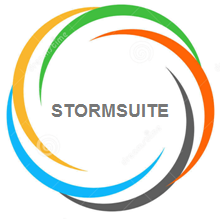

# StormSuite overview {#topic_b4x_rj1_v1b}

This section of the StormSuite Administration Guide provides an overview of the major components in StormSuite and how they support the unified deployment and adminstration of both Cloud and Cluster services.

-   **[Hybrid compute environments](../overview/overview_hybrid_compute_environments.html)**  

-   **[StormSuite - integrated solutions for a hybrid world](../overview/overview_stormsuite.html)**  

-   **[StormCenter - unified services and APIs](../overview/overview_stormcenter.html)**  

-   **[StormView](../overview/overview_stormview_intro.html)**  

-   **[StormSuite - the complete solution](../overview/overview_stormsuite_conclusion.html)**  

