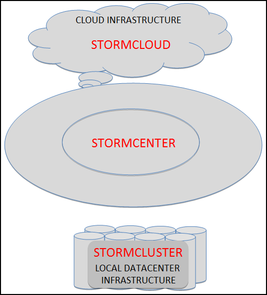

# StormCenter - unified services and APIs {#concept_ufb_zpf_51b .concept}

StormCenter provides a unified suite of services that can deploy, manage, monitor, and balance resources that reside on a Cloud or on a local Cluster.

One set of interfaces and services to perform the following management tasks in a hybrid environment:

-   *StormCenter-Analyzer*: description.
-   *StormCenter-Backup*: description.
-   *StormCenter-Balance*: description.
-   *StormCenter-Report*: description.
-   *StormCenter-Secure*: description.
-   *StormCenter-Store*: description.

-   **[StormCenter-Analyzer](../overview/overview_stormcenter_analyzer.html)**  

-   **[StormCenter-Backup](../overview/overview_stormcenter_backup.html)**  

-   **[StormCenter-Balance](../overview/overview_stormcenter_balance.html)**  

-   **[StormCenter-Report](../overview/overview_stormcenter_report.html)**  

-   **[StormCenter-Secure](../overview/overview_stormcenter_secure.html)**  

-   **[StormCenter-Store](../overview/overview_stormcenter_store.html)**  

**Parent topic:**[StormSuite overview](../overview/overview_glue.html)

