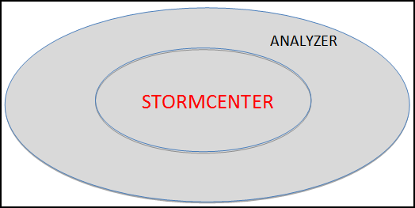

# StormCenter-Analyzer {#concept_o51_nrf_51b .concept}

StormCenter-Analyzer provides central administration for resources hosted on the Cloud or in your Cluster.

In the larger context of StormSuite, StormCenter-Analyzer does the following:

-   Conducts a complete inventory of available compute, network, and storage resources accessible to StormCloud or to StormCluster.
-   Provisions a central resource database with inventoried resources.
-   Monitors the availability and general health of each resource indentified in its inventory via layered "heartbeat" agents.
-   Serves inventory and status information to StormCenter-Report.

**Parent topic:**[StormCenter - unified services and APIs](../overview/overview_stormcenter.html)

