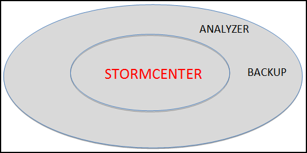

# StormCenter-Backup {#concept_tfk_vrf_51b .concept}

StormCenter-Backup provides central administration for configuration and data backups for all resources hosted on the Cloud or in your Cluster.

In the larger context of StormSuite, StormCenter-Backup does the following:

-   Provides a single Backup Policy Manager for resources available to StormCloud or to StormCluster.
-   Provides an easy-to-use web interface \(through StormView-Console\) to create, update, and manage backup policy definitions and profiles.
-   Executes backup policies and reports backup statistics to StormCenter-Report.

**Parent topic:**[StormCenter - unified services and APIs](../overview/overview_stormcenter.html)

