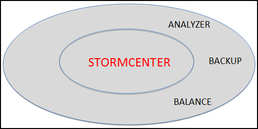

# StormCenter-Balance {#concept_eg4_yrf_51b .concept}

StormCenter-Balance provides basic resource balancing and capacity management services across resources hosted out of the Cloud or out of the Cluster.

In the larger context of StormSuite, StormCenter-Balance does the following:

-   Provides a single Capacity and Performance Manager for resources available to StormCloud or to StormCluster.
-   Provides an easy-to-use web interface \(through StormView-Console\) to create, update, and manage storage capacity or compute performance definitions and profiles.
-   Monitors capacity and performance threshholds throughout the system and reports to any of the StormView clients.
-   Reports general capacity and performance metrics to StormCenter-Report.

**Parent topic:**[StormCenter - unified services and APIs](../overview/overview_stormcenter.html)

