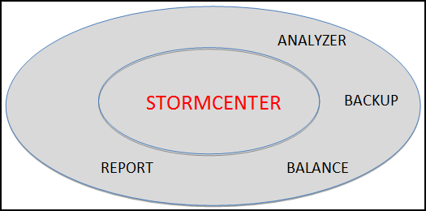
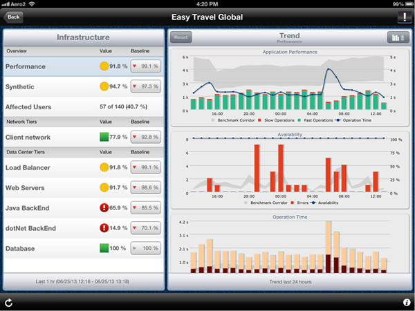

# StormCenter-Report {#concept_bgq_jsf_51b .concept}

StormCenter-Report collects metrics from all the StormCenter applications and makes them viewable in all the StormView clients.

In the larger context of StormSuite, StormCenter-Report does the following:

-   Provides a single point of collection for both StormCloud and StormCluster metrics on the following:
    -   Capacity utilization
    -   Networking performance
    -   Application performance
    -   System availability

StormView calls StormCenter-Report to obtain the most current data tables and diagrams.

**Parent topic:**[StormCenter - unified services and APIs](../overview/overview_stormcenter.html)

