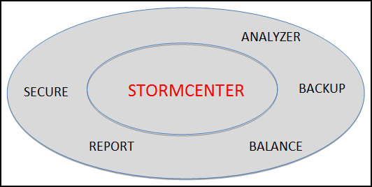
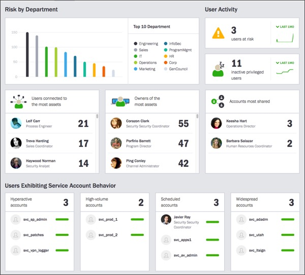

# StormCenter-Secure {#concept_j1x_rsf_51b .concept}

StormCenter-Secure provides a combination of account management and network security services for all StormSuite services and applications.

In the larger context of StormSuite, StormCenter-Secure does the following:

-   Provides enterprise-class account management.
-   Reports general capacity and performance metrics to StormCenter-Report.

StormView calls StormCenter-Report to obtain the most current data on system and user-account security.

**Parent topic:**[StormCenter - unified services and APIs](../overview/overview_stormcenter.html)

