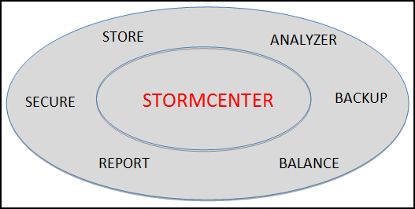

# StormCenter-Store {#concept_x25_vsf_51b .concept}

StormCenter-Store provides a master inventory of storage devices and assets hosted in the Cloud or in a local Cluster. StormCenter-Store does not store objects, but makes its global inventory of stored assets available by proxy to all StormSuite applications and services.

**Parent topic:**[StormCenter - unified services and APIs](../overview/overview_stormcenter.html)

