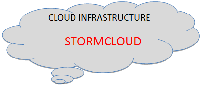

# StormCloud overview {#concept_c1z_qxk_51b .concept}

StormCloud provides a set of interfaces to the following Cloud-specific services:

-   *Cloud client interfaces*: The access and security interfaces required to allow web clients, mobile apps, or dedicated management applications to interact with Cloud services.
-   *Cloud storage*: The storage interfaces that allow multiple clients to access stored objects, be they physically residing on a public cloud, private cloud, or hybrid cloud. The cloud storage needs to be agile, flexible, scalable, multi-tenant, and secure.
-   *Service-oriented delivery*: The logical interfaces necessary to allow Cloud-based services to become available to multiple clients and tenants – Software as a service \(SaaS\), Development as a service \(DaaS\), Platform as a service \(PaaS\), and Infrastructure as a service \(IaaS\).

StormSuite administrators interact with StormCloud interfaces via StormCenter.

**Parent topic:**[StormSuite - integrated solutions for a hybrid world](../overview/overview_stormsuite.html)

