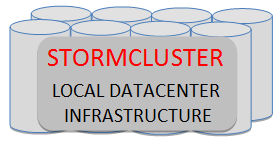

# StormCluster overview {#concept_zrh_fyk_51b .concept}

StormCluster provides a set of interfaces to the following Cluster-specific services:

-   Network-attached storage
-   Redundancy-aware node configurations
-   Failover and disaster-recovery policies

StormSuite administrators interact with StormCloud interfaces via StormCenter.

**Parent topic:**[StormSuite - integrated solutions for a hybrid world](../overview/overview_stormsuite.html)

