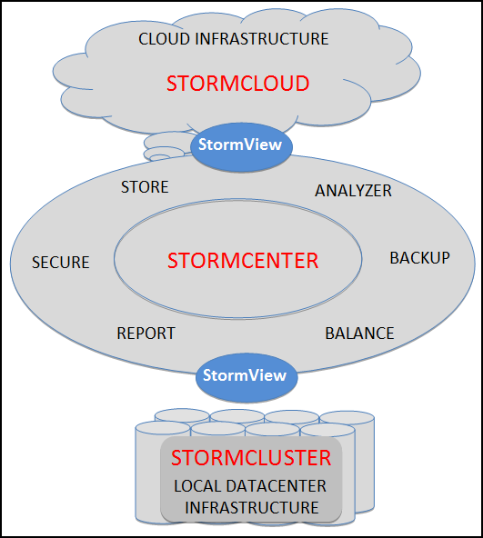

# StormSuite - integrated solutions for a hybrid world {#concept_asf_tpf_51b .concept}

StormSuite addresses this primary source of cost and disruption -- the need to maintain both Cloud-specific or Cluster-specific management infrastructure. With StormSuite, you can deploy one management infrastructure \(StormCenter\) designed to support services that are deployed on the Cloud and on Clusters. StormCloud and StormCluster provide the interface between the shared StormCenter management services and Cloud-specific or Cluster-specific environment.

To build out that complex, high-speed data center and hybrid Cloud infrastructure, you do not need to develop a library of specialized tools and applications -- StormCenter provides it all.

-   **[StormCloud overview](../overview/overview_stormcloud_overview.html)**  

-   **[StormCluster overview](../overview/overview_stormcluster_overview.html)**  

**Parent topic:**[StormSuite overview](../overview/overview_glue.html)

