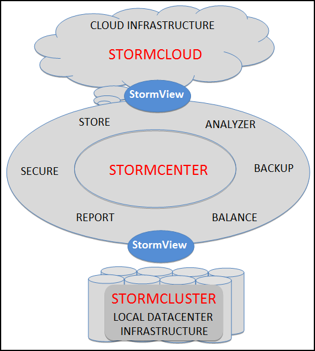

# StormView {#concept_vs2_1tf_51b .concept}

StormView provides a single interface for configuring, monitoring, and administering StormSuite assets – be they in the Cloud or in a local Cluster. StormView provides that consistent, complete, and elegant interface for StormSuite adminstrators.

StormView provides three, functionally equivalent interfaces:

-   StormView-Console: Desktop graphical console
-   StormView-Mobile: Mobile graphical interface
-   StormView-REST-API: RESTful application programming interface

-   **[StormView-Console](../overview/overview_stormview_console.html)**  

-   **[StormView-Mobile](../overview/overview_stormview_mobile.html)**  

-   **[StormView-REST-API](../overview/overview_stormview_rest-api.html)**  

**Parent topic:**[StormSuite overview](../overview/overview_glue.html)

